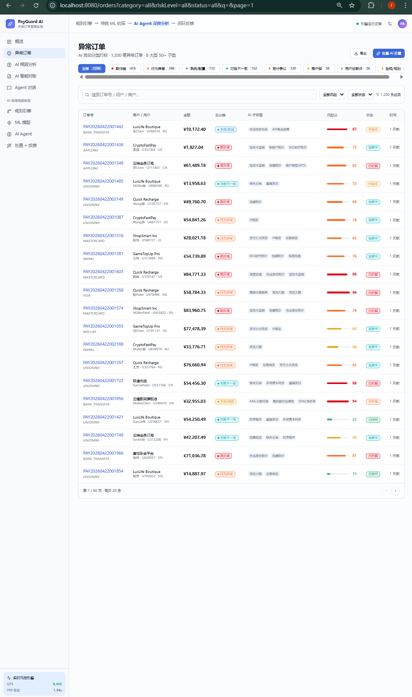
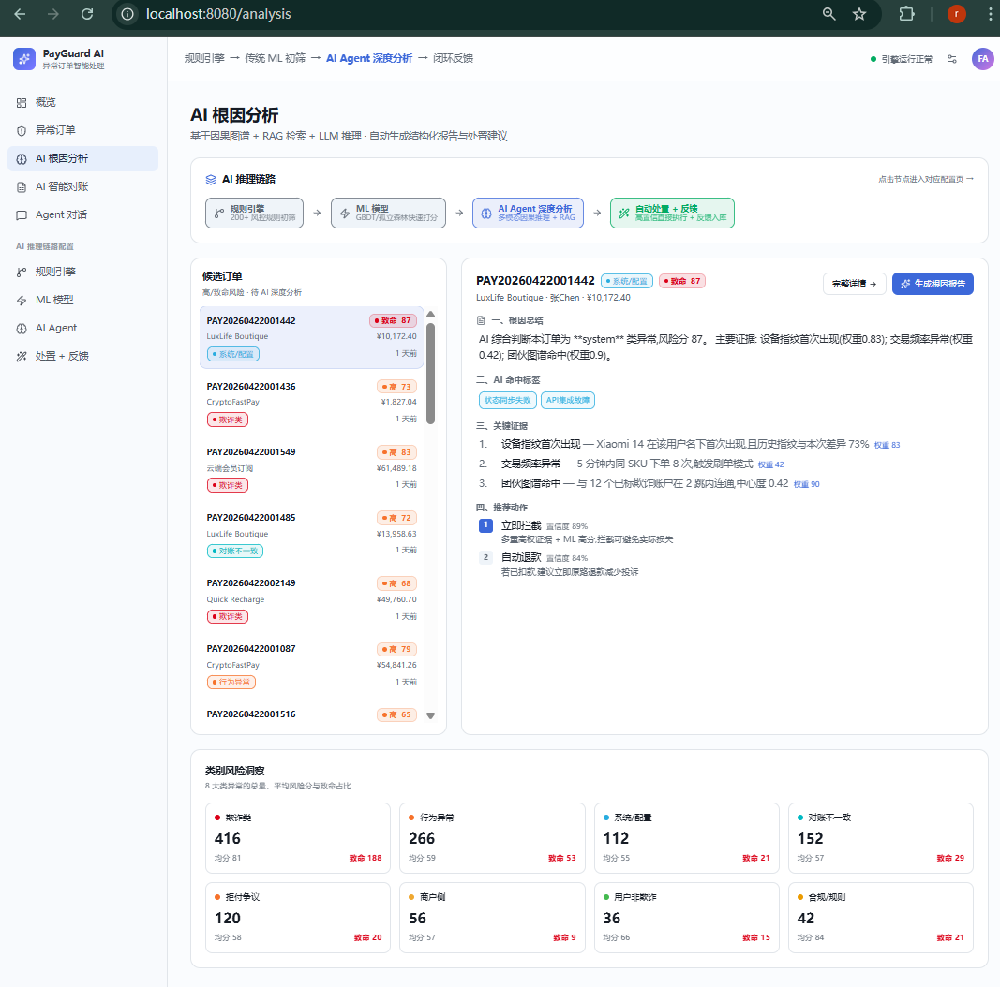
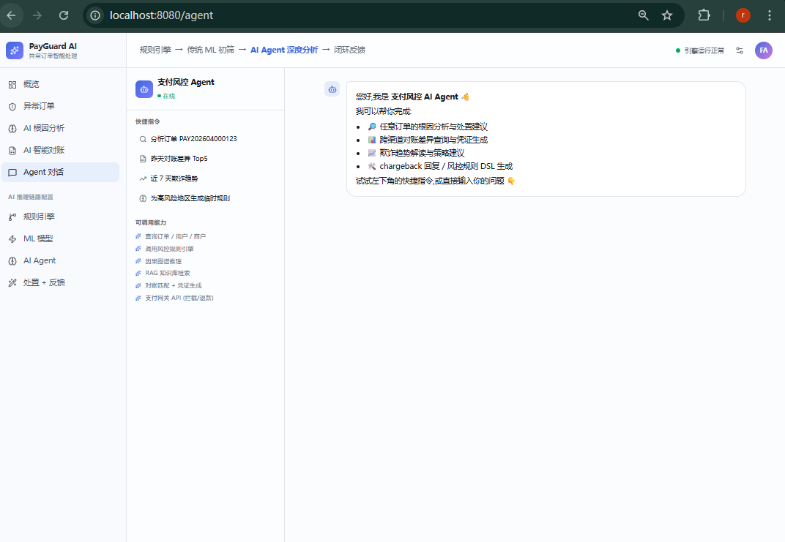
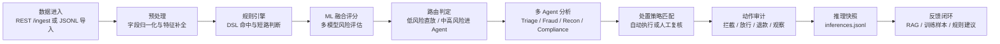

# PayGuard AI - 支付异常智能分析与处置平台

PayGuard AI 是一个面向支付风控、对账运营、拒付处理与合规审查场景的智能分析平台。项目以“规则引擎 + 传统机器学习 + 多 Agent 深度分析 + 闭环反馈”为核心链路，帮助团队从异常订单发现、根因定位、对账差异解释，到自动处置与人工反馈沉淀，形成可演示、可测试、可逐步生产化的完整原型系统。

> 当前阶段暂不接入真实数据库，后端使用本地 `storage/seeds` 与 `storage/runtime` 模拟种子数据、运行数据和全链路审计。后续可平滑替换为 PostgreSQL、Kafka、Redis、Milvus、Neo4j 等生产基础设施。

## 产品截图

### 异常订单分析



### AI 智能对账



### Agent 对话与根因分析



## 核心能力

- 异常订单工作台：支持订单检索、风险分类、风险评分、状态筛选、详情查看与处置动作。
- AI 根因分析：围绕欺诈、行为异常、系统异常、对账不一致、拒付争议、商户风险、用户争议与合规规则进行结构化分析。
- 智能对账：展示渠道流水与内部订单的差异、缺失、重复、金额差异、时序差异，并支持一键对账汇总。
- Agent 对话：提供面向支付运营人员的自然语言分析入口，可查询订单、解释根因、生成处置建议和规则建议。
- 规则引擎配置：支持规则列表、启停、DSL 条件表达式、命中统计和风险分加成。
- ML 模型配置：支持模型元数据管理、权重配置、阈值配置、重训触发和模型状态展示。
- 多 Agent 配置：支持 Agent、工具、知识库、Prompt、触发条件和运行指标管理。
- 处置与反馈闭环：支持策略配置、人工动作、反馈提交、训练样本沉淀和 RAG 知识回流。
- 本地文件模拟数据库：使用 JSON/JSONL 完成种子数据、运行数据、审计日志和测试数据导入。

## 业务流程



后端流水线已按阶段拆分到 `harmony-backend/backend/app/pipeline/stage_*`，便于后续维护和替换生产实现。

## 技术栈

| 层级 | 技术 | 说明 |
|---|---|---|
| 前端 | React / TypeScript / Vite / TanStack Router | 支付风控运营控制台与配置页面 |
| 后端 | Python / FastAPI / Pydantic | REST API、Schema 校验、业务编排 |
| AI Agent | 多 Agent 编排 / LLM Provider 抽象 | 支持 OpenAI、通义千问、DeepSeek、Mock Provider |
| ML | scikit-learn / XGBoost 风格训练与推理骨架 | 本地模型训练、模型元数据、融合评分 |
| RAG | 本地向量检索占位 | 当前为内存检索，预留 FAISS 持久化目录 |
| 存储 | JSON / JSONL / DiskCache | 无数据库阶段的本地持久化与审计 |
| 测试 | pytest / Vite build | 后端 API 冒烟测试与前端构建验证 |

## 仓库结构

```text
AIAbnormal/
├── harmony-flow/                  # 前端主项目
│   ├── src/routes/                # 页面路由
│   ├── src/lib/api.ts             # 前后端 API 适配层
│   └── src/lib/mock-data.ts       # 前端保留 mock 数据
├── harmony-backend/
│   ├── backend/                   # FastAPI 后端
│   │   ├── app/api/               # HTTP 路由
│   │   ├── app/agents/            # 多 Agent 编排
│   │   ├── app/llm/               # LLM Provider 抽象
│   │   ├── app/ml/                # ML 训练、推理、模型注册
│   │   ├── app/pipeline/          # 9 阶段业务流水线
│   │   ├── app/rules/             # 规则引擎与 DSL
│   │   ├── app/storage/           # Repository 与 JSONL 读写
│   │   ├── storage/seeds/         # 启动种子数据，提交到 Git
│   │   ├── storage/runtime/       # 运行时 JSONL，不提交 Git
│   │   ├── data/examples/         # 可提交的脱敏测试事件
│   │   └── tests/                 # 后端测试
│   └── src/                       # 前端副本/历史兼容目录
├── docs/images/                   # GitHub README 截图资源
├── backend-design-v1.md           # 后端设计文档
├── .gitignore
└── README.md
```

## 快速启动

### 1. 克隆项目

```powershell
git clone https://github.com/OneOranger/AIAbnormal.git
cd AIAbnormal
```

### 2. 启动后端

项目使用根目录已创建的 `.venv` 作为后端虚拟环境。

```powershell
cd E:\AIPG\AIAbnormal\harmony-backend\backend
E:\AIPG\AIAbnormal\.venv\Scripts\python.exe -m pip install -r requirements.txt
E:\AIPG\AIAbnormal\.venv\Scripts\python.exe -m app.scripts.reseed_data
E:\AIPG\AIAbnormal\.venv\Scripts\python.exe -m uvicorn app.main:app --reload --host 0.0.0.0 --port 8000
```

常用检查地址：

```text
http://localhost:8000/docs
http://localhost:8000/health
http://localhost:8000/system/storage
```

### 3. 启动前端

```powershell
cd E:\AIPG\AIAbnormal\harmony-flow
npm install
npm run dev
```

前端默认访问：

```text
http://localhost:8080/
```

### 4. 前端接入后端

在 `harmony-flow/.env.local` 中设置：

```env
VITE_API_BASE_URL=http://localhost:8000
```

如果不设置 `VITE_API_BASE_URL`，前端会使用内置 mock 数据，适合纯前端演示。

## 后端运行模式

### 客户演示模式

适合无真实数据、无真实大模型 Key 的演示环境。

```env
MOCK_DATA_ENABLED=true
SEED_DEFAULT_CONFIG=true
LLM_PROVIDER=mock
STORAGE_DIR=./storage
```

### 真实流程测试模式

适合使用真实大模型和本地生产风格 JSONL 数据测试完整业务流程。

```env
MOCK_DATA_ENABLED=false
SEED_DEFAULT_CONFIG=true
LLM_PROVIDER=deepseek
DEEPSEEK_API_KEY=your_deepseek_api_key_here
STORAGE_DIR=./storage
```

也可以切换为通义千问：

```env
LLM_PROVIDER=qwen
DASHSCOPE_API_KEY=your_dashscope_api_key_here
```

> 注意：真实 API Key 只能放在 `harmony-backend/backend/.env`，不要提交到 `.env.example` 或 Git 仓库。

## 本地数据说明

后端本地数据分为三层：

```text
harmony-backend/backend/storage/seeds/      # 启动种子数据，JSON 数组，可提交 Git
harmony-backend/backend/storage/runtime/    # 运行时数据，JSONL，不提交 Git
harmony-backend/backend/data/incoming/      # 客户脱敏样本或临时测试文件，不提交 Git
```

常见运行文件：

```text
storage/runtime/orders.jsonl       # 当前订单主数据
storage/runtime/recon.jsonl        # 当前对账主数据
storage/runtime/new_orders.jsonl   # 进单埋点
storage/runtime/inferences.jsonl   # 推理全链路快照
storage/runtime/actions.jsonl      # 自动/人工动作审计
storage/runtime/feedback.jsonl     # 人工反馈记录
```

导入测试事件并跑完整流水线：

```powershell
cd E:\AIPG\AIAbnormal\harmony-backend\backend
E:\AIPG\AIAbnormal\.venv\Scripts\python.exe -m app.scripts.ingest_events data/examples/payment_events.jsonl --run-pipeline
```

## API 概览

| 模块 | 接口 |
|---|---|
| 订单 | `GET /orders`、`GET /orders/{id}`、`POST /orders/{id}/actions`、`POST /orders/{id}/analyze` |
| 进单 | `POST /ingest` |
| 对账 | `GET /reconciliation`、`POST /reconciliation/match` |
| Agent 对话 | `POST /agent/chat`、`POST /agent/chat/stream` |
| 规则 | `GET /rules`、`POST /rules`、`POST /rules/{id}/toggle` |
| 模型 | `GET /models`、`PATCH /models/{id}`、`POST /models/{id}/retrain` |
| Agent 配置 | `GET /agents`、`GET /agents/kb`、`PATCH /agents/{id}`、`POST /agents/{id}/test` |
| 策略与反馈 | `GET /policies`、`POST /policies`、`POST /policies/{id}/toggle`、`GET /feedback`、`POST /feedback` |
| 系统诊断 | `GET /health`、`GET /system/storage`、`GET /system/perf`、`GET /system/inferences`、`GET /system/actions` |

## 测试与验证

后端测试：

```powershell
cd E:\AIPG\AIAbnormal\harmony-backend\backend
E:\AIPG\AIAbnormal\.venv\Scripts\python.exe -m pytest -q
```

前端构建：

```powershell
cd E:\AIPG\AIAbnormal\harmony-flow
npm run build
```

后端设计对齐与端到端测试文档：

- `harmony-backend/backend/BACKEND_DESIGN_ALIGNMENT.md`
- `harmony-backend/backend/E2E_TESTING_GUIDE.md`
- `harmony-backend/backend/LOCAL_DATA_TESTING.md`
- `harmony-backend/backend/TESTING.md`

## 安全与提交规范

以下内容不要提交到 GitHub：

```text
.env
.env.local
node_modules/
dist/
storage/runtime/*.jsonl
data/incoming/
data/models/*.pkl
```

提交前建议执行：

```powershell
git status
git diff
git add -A
git commit -m "your commit message"
git push origin main
```

如果修改了后端，建议先跑：

```powershell
E:\AIPG\AIAbnormal\.venv\Scripts\python.exe -m pytest -q
```

如果修改了前端，建议先跑：

```powershell
npm run build
```

## 当前边界与路线图

当前阶段已完成无数据库版本的完整业务闭环。后续可以逐步替换为生产级能力：

- 接入 Kafka/SFTP/Webhook 作为真实事件入口。
- 使用 PostgreSQL 或 ClickHouse 存储订单、对账和反馈数据。
- 使用 Redis 替代本地 DiskCache。
- 使用 Milvus/Qdrant 或持久化 FAISS 替代内存向量检索。
- 使用 Neo4j/NebulaGraph 接入团伙图谱与设备/IP/账户关联分析。
- 将支付网关动作从本地审计扩展为真实拦截、退款、冻结、通知 API。
- 增加 WebSocket/SSE，将推理结果和处置状态实时推送到前端。
- 增加模型漂移监控、A/B 实验、影子模型和自动重训流程。

## License

本项目当前为内部研发与演示用途。正式开源或商用前，请补充 License、贡献规范和安全披露流程。
